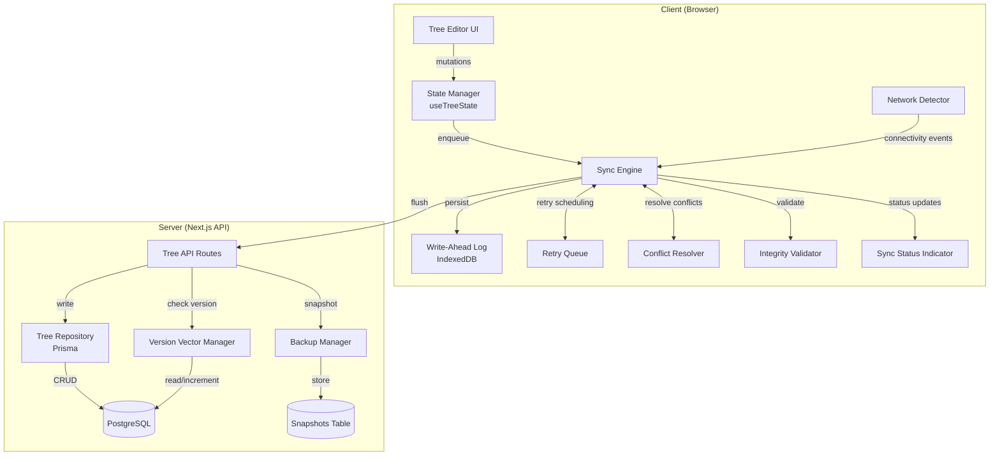
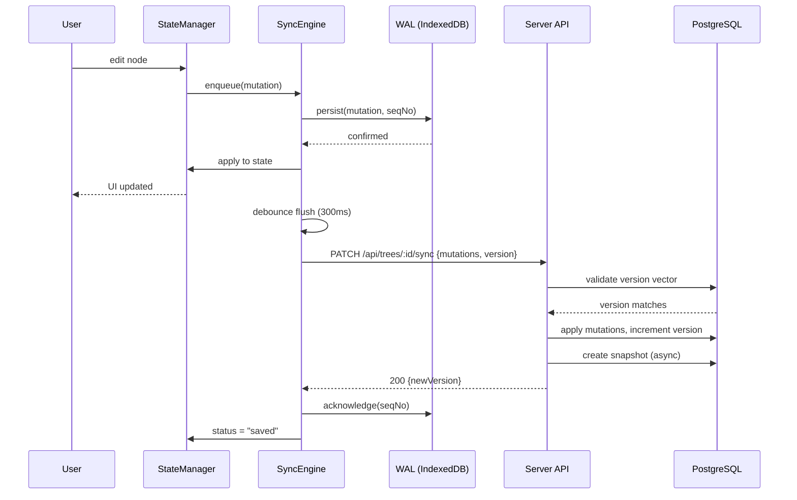
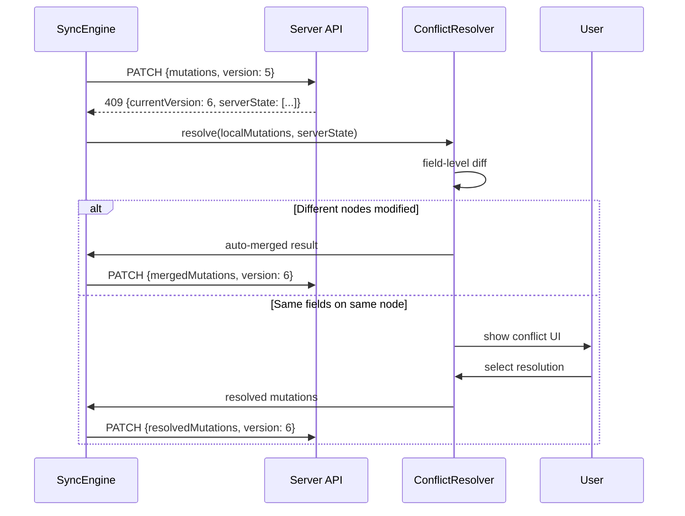
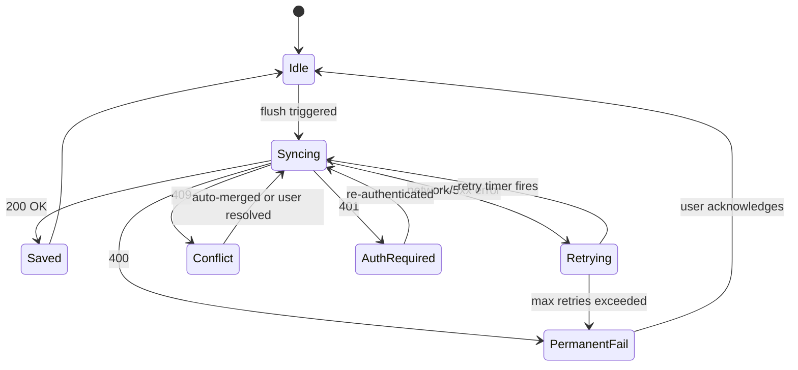

# Design Document: Data Reliability & Sync

## Overview

This design replaces the current "debounced PUT with full replacement" sync mechanism with a robust offline-first synchronization engine. The new architecture introduces a Write-Ahead Log (WAL) backed by IndexedDB, an automatic retry system with exponential backoff, server-side version vectors for conflict detection, field-level conflict resolution, periodic server-side snapshots for backup/recovery, and client-side data integrity validation.

The system is designed around the principle that **no user edit should ever be lost**, regardless of network conditions, browser crashes, or session expiration. All mutations are durably recorded in IndexedDB before being applied to in-memory state, and a background sync engine flushes them to the server with ordering guarantees.

### Key Design Decisions

1. **IndexedDB as primary WAL store** — survives browser crashes, has ~50MB+ capacity vs localStorage's 5MB limit
2. **Monotonic sequence numbers** — guarantee replay ordering without relying on wall-clock time
3. **Server-side version vector** — single integer per tree, incremented on each successful write, enables optimistic concurrency control
4. **Field-level conflict resolution** — avoids forcing users to choose entire node states when only one field differs
5. **Snapshot-based backups** — stored in a separate table, decoupled from live data, with a rolling window of 50 snapshots per tree

### Relationship to Current Architecture

```
┌─────────────────────────────────────────────────────────────────┐
│                        CURRENT (being replaced)                  │
│  useTreeState → saveTrees(localStorage) → debounce 600ms → PUT  │
│  No retry, no WAL, no conflict detection                        │
└─────────────────────────────────────────────────────────────────┘

┌─────────────────────────────────────────────────────────────────┐
│                        NEW ARCHITECTURE                          │
│  useTreeState → SyncEngine.enqueue(mutation)                    │
│       ├── WAL.persist(mutation) [IndexedDB]                     │
│       ├── apply to in-memory state                              │
│       └── SyncEngine.flush()                                    │
│              ├── validate integrity                              │
│              ├── send with version vector                        │
│              ├── handle 409 → ConflictResolver                  │
│              ├── handle 5xx/network → RetryQueue (exp backoff)  │
│              ├── handle 401 → pause + re-auth prompt            │
│              └── on success → WAL.acknowledge(seqNo)            │
└─────────────────────────────────────────────────────────────────┘
```

## Architecture

### High-Level System Diagram



### Component Interaction Sequence (Happy Path)



### Conflict Resolution Sequence



## Components and Interfaces

### 1. SyncEngine (`lib/sync/SyncEngine.ts`)

The central orchestrator that coordinates WAL writes, network sync, retry logic, and status reporting.

```typescript
interface SyncEngineConfig {
  debounceMs: number;          // Default: 300ms
  maxRetries: number;          // Default: 10
  baseRetryDelayMs: number;    // Default: 1000ms
  maxRetryDelayMs: number;     // Default: 60000ms
  jitterMs: number;            // Default: 500ms
  healthCheckIntervalMs: number; // Default: 30000ms
  requestTimeoutMs: number;    // Default: 30000ms
}

type SyncStatus = "saved" | "syncing" | "pending" | "offline" | "error";

interface SyncStatusInfo {
  status: SyncStatus;
  pendingCount: number;
  errorMessage?: string;
  lastSyncedAt?: number;
}

class SyncEngine {
  constructor(config: Partial<SyncEngineConfig>);

  // Core operations
  enqueue(treeId: string, mutation: Mutation): Promise<void>;
  flush(): Promise<void>;
  pause(): void;
  resume(): void;

  // Status
  getStatus(): SyncStatusInfo;
  onStatusChange(callback: (status: SyncStatusInfo) => void): () => void;

  // Lifecycle
  initialize(): Promise<void>;  // Replays pending WAL entries on startup
  destroy(): void;              // Cleanup timers, listeners

  // Manual controls
  retryFailed(): Promise<void>;
  forceSync(): Promise<void>;
}
```

### 2. WriteAheadLog (`lib/sync/WriteAheadLog.ts`)

Durable mutation store backed by IndexedDB with localStorage fallback.

```typescript
interface WALEntry {
  id: string;                  // UUID
  seqNo: number;              // Monotonically increasing
  treeId: string;
  timestamp: number;          // Date.now()
  type: "add" | "update" | "delete";
  nodeId: string;
  payload: FamilyNode | null; // Full node state after mutation (null for delete)
  status: "pending" | "sending" | "failed";
  retryCount: number;
  lastAttempt?: number;
}

interface WriteAheadLog {
  // Write operations
  append(entry: Omit<WALEntry, "id" | "seqNo" | "status" | "retryCount">): Promise<WALEntry>;
  acknowledge(seqNo: number): Promise<void>;
  markFailed(seqNo: number, error: string): Promise<void>;
  markPermanentlyFailed(seqNo: number): Promise<void>;

  // Read operations
  getPending(treeId: string): Promise<WALEntry[]>;
  getAllPending(): Promise<WALEntry[]>;
  getCount(): Promise<number>;

  // Maintenance
  clear(treeId: string): Promise<void>;
  prune(olderThanDays: number): Promise<void>;

  // Capacity
  isFull(): Promise<boolean>;
  getCapacity(): Promise<{ used: number; max: number }>;
}
```

### 3. RetryQueue (`lib/sync/RetryQueue.ts`)

Manages exponential backoff scheduling for failed sync attempts.

```typescript
interface RetrySchedule {
  seqNo: number;
  nextAttemptAt: number;      // Timestamp
  attemptCount: number;
  maxAttempts: number;
  baseDelay: number;
  maxDelay: number;
  jitter: number;
}

class RetryQueue {
  constructor(config: { maxRetries: number; baseDelay: number; maxDelay: number; jitter: number });

  schedule(seqNo: number): RetrySchedule;
  getNextDue(): RetrySchedule | null;
  cancel(seqNo: number): void;
  cancelAll(): void;
  isExhausted(seqNo: number): boolean;

  // Compute delay: min(baseDelay * 2^attempt, maxDelay) + random(-jitter, +jitter)
  computeDelay(attemptCount: number): number;
}
```

### 4. ConflictResolver (`lib/sync/ConflictResolver.ts`)

Detects and resolves concurrent edit conflicts using field-level diffing.

```typescript
interface ConflictInfo {
  nodeId: string;
  field: string;
  localValue: unknown;
  serverValue: unknown;
  localTimestamp: number;
  serverTimestamp: number;
}

interface ConflictResolution {
  nodeId: string;
  field: string;
  chosenValue: unknown;
  source: "local" | "server";
}

type AutoMergeResult = {
  type: "auto-merged";
  mergedNodes: FamilyNode[];
  newVersion: number;
};

type ManualMergeResult = {
  type: "manual-required";
  conflicts: ConflictInfo[];
  nonConflictingMerge: FamilyNode[];  // Nodes that could be auto-merged
};

class ConflictResolver {
  detect(
    localMutations: WALEntry[],
    serverState: FamilyNode[],
    serverVersion: number
  ): AutoMergeResult | ManualMergeResult;

  resolve(
    conflicts: ConflictInfo[],
    resolutions: ConflictResolution[]
  ): FamilyNode[];

  // Returns true if conflicts affect different nodes (auto-mergeable)
  canAutoMerge(localMutations: WALEntry[], serverState: FamilyNode[]): boolean;
}
```

### 5. IntegrityValidator (`lib/sync/IntegrityValidator.ts`)

Validates tree data structure for referential integrity before sync.

```typescript
interface ValidationError {
  type: "orphan-parent-ref" | "unidirectional-partner" | "circular-ancestor" | "duplicate-id";
  nodeId: string;
  details: string;
}

interface ValidationResult {
  valid: boolean;
  errors: ValidationError[];
}

class IntegrityValidator {
  validate(nodes: FamilyNode[]): ValidationResult;

  // Individual checks
  checkParentReferences(nodes: FamilyNode[]): ValidationError[];
  checkBidirectionalPartners(nodes: FamilyNode[]): ValidationError[];
  checkCircularAncestors(nodes: FamilyNode[]): ValidationError[];
  checkDuplicateIds(nodes: FamilyNode[]): ValidationError[];
}
```

### 6. NetworkDetector (`lib/sync/NetworkDetector.ts`)

Monitors network connectivity using Navigator.onLine + periodic health checks.

```typescript
class NetworkDetector {
  constructor(healthCheckUrl: string, intervalMs: number);

  isOnline(): boolean;
  onStatusChange(callback: (online: boolean) => void): () => void;

  start(): void;
  stop(): void;

  // Force a health check immediately
  check(): Promise<boolean>;
}
```

### 7. BackupManager (Server-Side) (`lib/sync/BackupManager.ts`)

Server-side module for creating and managing tree snapshots.

```typescript
interface TreeSnapshot {
  id: string;
  treeId: string;
  version: number;
  nodeCount: number;
  data: { nodes: FamilyNode[]; edges: DbEdge[] };
  createdAt: Date;
}

class BackupManager {
  createSnapshot(treeId: string, version: number): Promise<TreeSnapshot>;
  listSnapshots(treeId: string): Promise<Omit<TreeSnapshot, "data">[]>;
  getSnapshot(snapshotId: string): Promise<TreeSnapshot>;
  restoreSnapshot(treeId: string, snapshotId: string, userId: string): Promise<void>;

  // Retention: keep max 50 per tree
  pruneOldSnapshots(treeId: string, maxCount: number): Promise<void>;
}
```

### 8. Sync API Endpoint (`app/api/trees/[id]/sync/route.ts`)

New endpoint that replaces the full-replacement PUT with version-aware incremental sync.

```typescript
// POST /api/trees/:id/sync
interface SyncRequest {
  mutations: Array<{
    type: "add" | "update" | "delete";
    nodeId: string;
    payload: FamilyNode | null;
    seqNo: number;
  }>;
  clientVersion: number;  // Last known version
}

interface SyncResponse {
  success: boolean;
  newVersion: number;
  acknowledgedSeqNos: number[];
}

// 409 Conflict Response
interface ConflictResponse {
  error: "version-conflict";
  currentVersion: number;
  serverState: FamilyNode[];  // Current full tree state
  conflictingNodeIds: string[];
}
```

### 9. Export/Import Module (`lib/sync/ExportManager.ts`)

Handles manual JSON export and validated import.

```typescript
interface ExportData {
  version: 1;
  exportedAt: string;
  tree: {
    id: string;
    name: string;
    nodes: FamilyNode[];
  };
}

interface ImportValidation {
  valid: boolean;
  errors: string[];
  nodeCount?: number;
  duplicateIds?: string[];
}

class ExportManager {
  export(tree: TreeData): Blob;
  validateImport(file: File): Promise<ImportValidation>;
  parseImport(file: File): Promise<ExportData>;
}
```

### 10. Updated useTreeState Hook

The existing hook is refactored to delegate persistence to SyncEngine:

```typescript
// Changes to useTreeState:
// 1. Remove direct localStorage writes (saveTrees)
// 2. Remove debounced saveTreeNodes call
// 3. Replace with SyncEngine.enqueue() calls
// 4. Subscribe to SyncEngine status for syncStatus state
// 5. Add beforeunload handler via SyncEngine

export function useTreeState(userId: string, userName: string) {
  const syncEngine = useSyncEngine(userId);  // New hook wrapping SyncEngine

  // syncStatus now comes from SyncEngine subscription
  const [syncStatus, setSyncStatus] = useState<SyncStatusInfo>(
    syncEngine.getStatus()
  );

  // Mutations now go through SyncEngine
  const addNode = useCallback((...) => {
    // ... compute updatedNodes as before ...
    syncEngine.enqueue(currentTreeId, {
      type: "add",
      nodeId: newNodeId,
      payload: finalNewNode,
    });
  }, [...]);
}
```

## Data Models

### New Prisma Schema Additions

```prisma
// Add version field to Tree model
model Tree {
  id        String   @id @default(cuid())
  name      String
  ownerId   String
  version   Int      @default(1)  // NEW: version vector
  createdAt DateTime @default(now())
  updatedAt DateTime @updatedAt

  owner       User           @relation("TreeOwner", fields: [ownerId], references: [id], onDelete: Cascade)
  nodes       Node[]
  edges       Edge[]
  memberships TreeMember[]
  snapshots   TreeSnapshot[] // NEW

  @@index([ownerId])
}

// NEW: Snapshot storage for backup/recovery
model TreeSnapshot {
  id        String   @id @default(cuid())
  treeId    String
  version   Int      // Version at time of snapshot
  nodeCount Int
  data      Json     // Complete serialized tree state
  createdAt DateTime @default(now())

  tree Tree @relation(fields: [treeId], references: [id], onDelete: Cascade)

  @@index([treeId, createdAt])
}
```

### IndexedDB Schema (Client-Side)

```typescript
// Database: "lifestory-sync"
// Version: 1

interface WALStore {
  // Object store: "wal"
  // Key path: "id"
  // Indexes: ["seqNo", "treeId", "status", "timestamp"]
  id: string;
  seqNo: number;
  treeId: string;
  timestamp: number;
  type: "add" | "update" | "delete";
  nodeId: string;
  payload: FamilyNode | null;
  status: "pending" | "sending" | "failed" | "permanently-failed";
  retryCount: number;
  lastAttempt: number | null;
  errorMessage: string | null;
}

interface MetaStore {
  // Object store: "meta"
  // Key path: "key"
  key: string;  // e.g., "lastSeqNo", "lastSyncedVersion:{treeId}"
  value: number | string;
}

interface ConflictStore {
  // Object store: "conflicts"
  // Key path: "id"
  id: string;
  treeId: string;
  conflicts: ConflictInfo[];
  localState: FamilyNode[];
  serverState: FamilyNode[];
  createdAt: number;
  resolvedAt: number | null;
}
```

### Mutation Payload Format

```typescript
// What gets stored in WAL and sent to server
interface Mutation {
  type: "add" | "update" | "delete";
  nodeId: string;
  payload: FamilyNode | null;  // Full node state after mutation; null for deletes
  timestamp: number;
  treeId: string;
}

// Batched sync request (multiple mutations coalesced)
interface SyncBatch {
  treeId: string;
  clientVersion: number;
  mutations: Array<{
    seqNo: number;
    type: Mutation["type"];
    nodeId: string;
    payload: FamilyNode | null;
  }>;
}
```

### Retry Delay Computation

```typescript
// Exponential backoff with jitter
function computeRetryDelay(
  attemptCount: number,
  baseDelay: number = 1000,
  maxDelay: number = 60000,
  jitter: number = 500
): number {
  const exponentialDelay = Math.min(baseDelay * Math.pow(2, attemptCount), maxDelay);
  const jitterOffset = (Math.random() * 2 - 1) * jitter; // ±jitter
  return Math.max(0, exponentialDelay + jitterOffset);
}
```

## Correctness Properties

*A property is a characteristic or behavior that should hold true across all valid executions of a system — essentially, a formal statement about what the system should do. Properties serve as the bridge between human-readable specifications and machine-verifiable correctness guarantees.*

### Property 1: WAL Replay Ordering

*For any* set of WAL entries with distinct sequence numbers, replaying or flushing those entries SHALL always process them in strictly ascending sequence number order, regardless of their timestamps or insertion order.

**Validates: Requirements 1.3, 3.4**

### Property 2: WAL Entry Structure Completeness

*For any* mutation (add, update, or delete) enqueued to the WAL, the resulting WAL entry SHALL contain a non-empty unique identifier, a monotonically increasing sequence number greater than all previous entries, a positive timestamp, a non-empty tree identifier, and the full node state (or null for deletes).

**Validates: Requirements 1.4**

### Property 3: WAL Acknowledge Removes Entry

*For any* WAL containing pending entries, acknowledging an entry by its sequence number SHALL remove exactly that entry from the pending set, leaving all other pending entries unchanged.

**Validates: Requirements 1.5**

### Property 4: Exponential Backoff Bounds

*For any* attempt count n ≥ 0, base delay b, maximum delay m, and jitter j, the computed retry delay SHALL satisfy: `max(0, min(b * 2^n, m) - j) ≤ delay ≤ min(b * 2^n, m) + j`.

**Validates: Requirements 1.7, 3.1, 7.6**

### Property 5: WAL Capacity Enforcement

*For any* WAL at its maximum capacity (1000 entries for IndexedDB, 50 for localStorage fallback), attempting to append a new entry SHALL be rejected, and the WAL size SHALL remain at the maximum.

**Validates: Requirements 1.8, 7.2, 7.7**

### Property 6: Sync Status State Machine Validity

*For any* sequence of sync engine events (enqueue, flush-start, flush-success, flush-failure, network-offline, network-online), the resulting sync status SHALL always be exactly one of: "saved", "syncing", "pending", "offline", or "error".

**Validates: Requirements 2.1**

### Property 7: Pending Count Display Format

*For any* non-negative integer count of pending mutations, the display string SHALL be the exact decimal representation for counts 0–99, and "99+" for any count greater than 99.

**Validates: Requirements 2.4**

### Property 8: Version Vector Monotonicity

*For any* sequence of successful writes to a tree, the version vector SHALL increment by exactly 1 after each write, starting from 1, producing a strictly increasing sequence with no gaps.

**Validates: Requirements 4.1**

### Property 9: Version Mismatch Rejection

*For any* sync request where the client's version does not equal the server's current version, the server SHALL reject the request with a 409 status and return the current server state, without modifying the tree data.

**Validates: Requirements 4.3**

### Property 10: Field-Level Diff Correctness

*For any* two FamilyNode instances representing the local and server versions of the same node, the conflict detector SHALL identify exactly the set of fields where the values differ, with no false positives (reporting equal fields as conflicting) and no false negatives (missing actually differing fields).

**Validates: Requirements 4.4, 4.6**

### Property 11: Non-Overlapping Conflict Auto-Merge

*For any* set of local mutations affecting nodes {A} and server changes affecting nodes {B} where A ∩ B = ∅, the auto-merge result SHALL contain all local changes and all server changes, and the merged node set SHALL equal the union of both change sets applied to the base state.

**Validates: Requirements 4.5**

### Property 12: Snapshot Retention Limit

*For any* tree, after any snapshot creation operation, the total number of retained snapshots SHALL be at most 50, and if a snapshot was removed, it SHALL be the one with the oldest creation timestamp.

**Validates: Requirements 5.2**

### Property 13: Restore Produces Exact Snapshot State

*For any* valid snapshot and any current tree state, restoring that snapshot SHALL result in the tree's node set being deeply equal to the snapshot's stored node data, and a new snapshot containing the pre-restore state SHALL exist.

**Validates: Requirements 5.4**

### Property 14: Failed Restore Preserves Original State

*For any* tree state and any restore operation that fails (due to database error or constraint violation), the tree's node set SHALL remain deeply equal to its state before the restore attempt.

**Validates: Requirements 5.7**

### Property 15: Integrity Validator Detects All Corruption Types

*For any* tree with injected corruption (orphan parent reference, unidirectional partner link, circular ancestor chain, or duplicate node ID), the integrity validator SHALL return `valid: false` and include at least one error of the corresponding type. Conversely, *for any* well-formed tree (all parent references valid, all partner links bidirectional, no cycles, no duplicate IDs), the validator SHALL return `valid: true`.

**Validates: Requirements 6.1, 6.2**

### Property 16: WAL Retention Policy

*For any* WAL entry with a timestamp less than 7 days old, the prune operation SHALL NOT remove that entry, regardless of session state or sync status.

**Validates: Requirements 8.4**

### Property 17: Export/Import Round-Trip

*For any* valid TreeData, exporting to JSON and then importing and parsing that JSON SHALL produce a tree with the same id, name, and an equivalent set of nodes (same node IDs, same field values).

**Validates: Requirements 9.1, 9.3**

### Property 18: Export Filename Format

*For any* tree name and any date, the generated export filename SHALL match the pattern `{sanitized-tree-name}-{YYYY-MM-DD}.json` where the tree name has non-alphanumeric characters replaced with hyphens.

**Validates: Requirements 9.2**

### Property 19: Import Duplicate ID Detection

*For any* import payload containing node IDs that overlap with existing tree node IDs, the import validator SHALL identify and return exactly the set of overlapping IDs.

**Validates: Requirements 9.5**

## Error Handling

### Client-Side Error Categories

| Error Type | HTTP Status | Handling Strategy |
|---|---|---|
| Network failure | N/A (timeout/DNS/TCP) | Queue in WAL, retry with exponential backoff |
| Server error | 5xx | Queue in WAL, retry with exponential backoff |
| Unauthorized | 401 | Pause sync, show re-auth prompt, preserve WAL |
| Validation error | 400 | Mark permanently failed, notify user with details |
| Version conflict | 409 | Trigger ConflictResolver flow |
| Storage full | N/A (IndexedDB quota) | Block new mutations, show capacity warning |
| Data corruption | N/A (validation fail) | Halt sync, show reload option |

### Error Recovery Flows



### Graceful Degradation Hierarchy

1. **Full connectivity**: Real-time sync, snapshots, conflict detection
2. **Intermittent connectivity**: WAL queues mutations, exponential backoff retries
3. **Fully offline**: All edits stored in WAL, capacity warnings at thresholds
4. **IndexedDB unavailable**: Fall back to localStorage with 50-mutation limit + warning
5. **All storage unavailable**: In-memory only with prominent "data at risk" warning

### beforeunload Protection

```typescript
// Registered when pendingCount > 0 or status === "syncing"
window.addEventListener("beforeunload", (e) => {
  if (syncEngine.getStatus().pendingCount > 0) {
    e.preventDefault();
    e.returnValue = `You have ${pendingCount} unsaved changes. Are you sure you want to leave?`;
  }
});
```

## Testing Strategy

### Property-Based Testing

**Library**: [fast-check](https://github.com/dubzzz/fast-check) (TypeScript PBT library, well-maintained, integrates with Vitest)

**Configuration**:
- Minimum 100 iterations per property test
- Each test tagged with property reference comment
- Tag format: `// Feature: data-reliability-sync, Property {N}: {title}`

**Property tests cover**:
- WAL ordering, capacity, acknowledgment, retention (Properties 1–5, 16)
- Sync status state machine (Property 6)
- Display formatting (Property 7)
- Version vector behavior (Properties 8–9)
- Conflict detection and resolution (Properties 10–11)
- Backup retention and restore (Properties 12–14)
- Integrity validation (Property 15)
- Export/import round-trip (Properties 17–19)

### Unit Tests (Example-Based)

- IndexedDB fallback to localStorage (Req 1.6)
- Specific sync status transitions (Req 2.2, 2.3, 2.5, 2.6, 2.7)
- 401/400 error handling paths (Req 3.5, 3.6)
- Conflict UI presentation (Req 4.8, 4.9)
- Snapshot creation failure handling (Req 5.6)
- Corruption detection halts sync (Req 6.3, 6.4, 6.5)
- Session expiration prompt (Req 8.1, 8.2, 8.5, 8.6)
- Import validation error messages (Req 9.4)
- Offline export (Req 9.6)

### Integration Tests

- Full WAL → sync → acknowledge cycle with mocked API
- Network transition (offline → online) triggers flush
- beforeunload handler registration
- IndexedDB persistence across simulated page reload
- Conflict resolution end-to-end flow
- Backup restore with database transaction

### Test File Organization

```
__tests__/
  sync/
    wal.property.test.ts          # Properties 1-5, 16
    retryDelay.property.test.ts   # Property 4
    syncStatus.property.test.ts   # Properties 6-7
    versionVector.property.test.ts # Properties 8-9
    conflictResolver.property.test.ts # Properties 10-11
    backupManager.property.test.ts # Properties 12-14
    integrityValidator.property.test.ts # Property 15
    exportImport.property.test.ts # Properties 17-19
    syncEngine.unit.test.ts       # Example-based unit tests
    syncEngine.integration.test.ts # Integration tests
```

