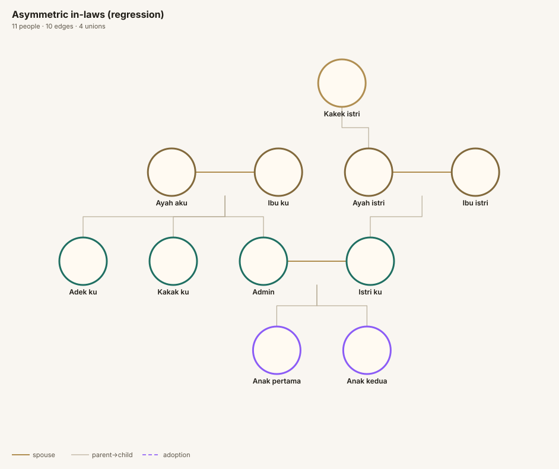
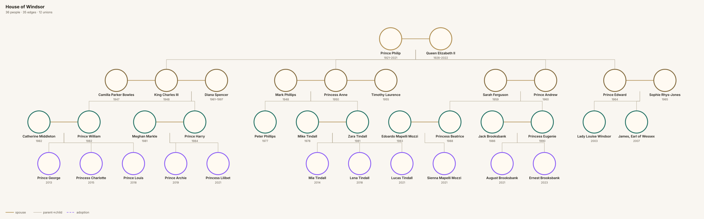
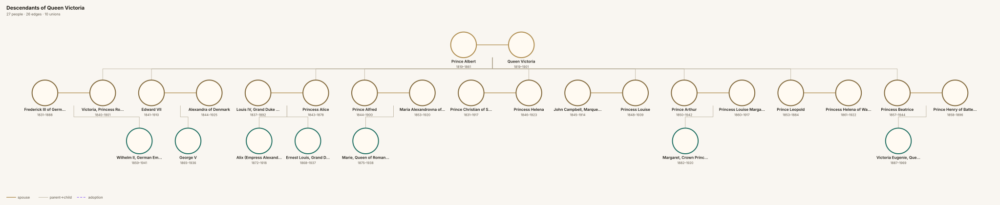
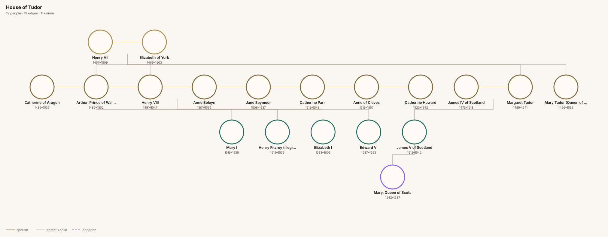
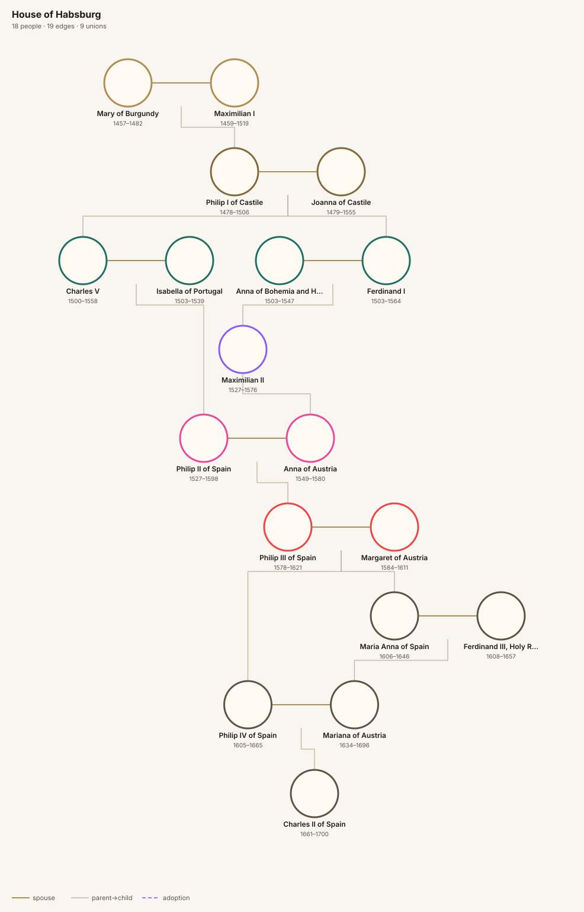
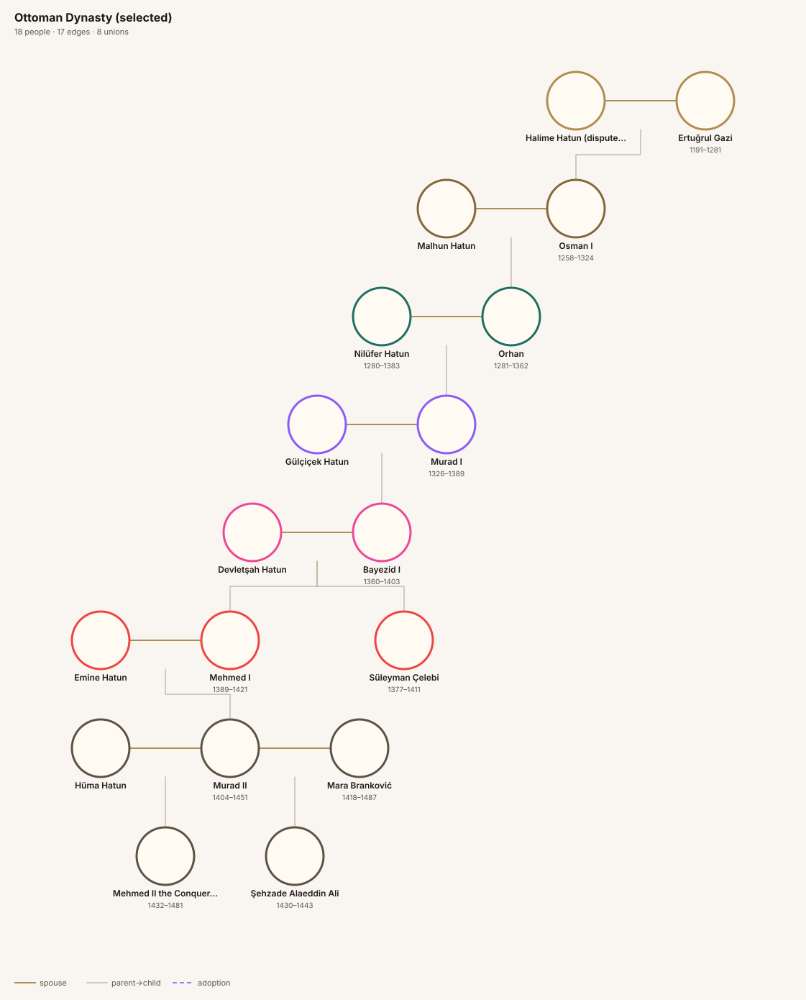
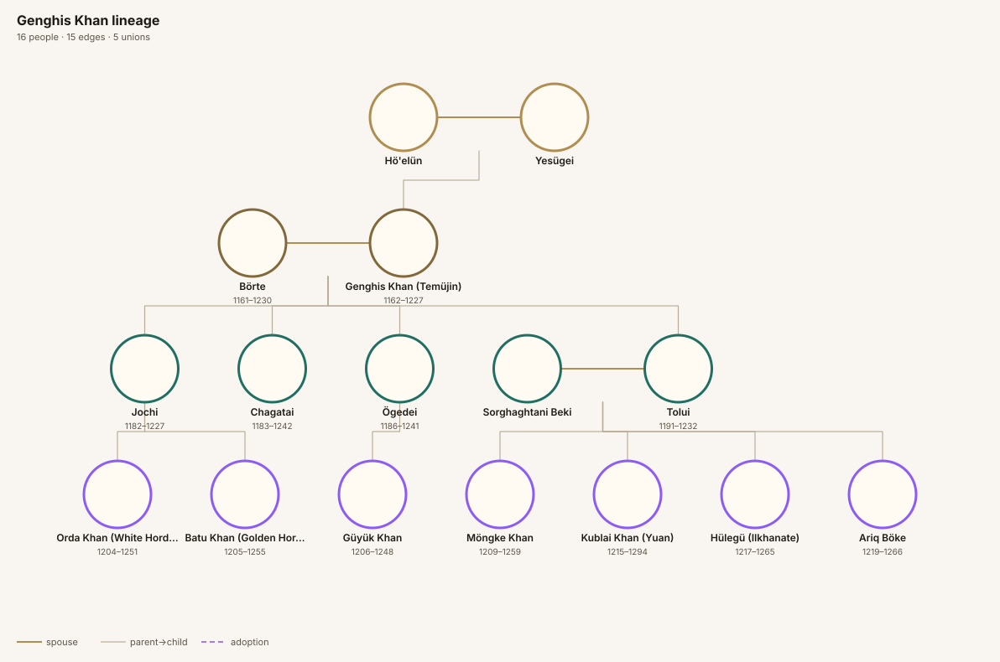

# Lifestory Family Tree — Real Family Layout Report

Generated at 2026-05-13T14:00:43.674Z by `scripts/real-family-report.ts`.

Every fixture below is fed through the *same* `calculateSugiyamaLayout` used by the production Canvas renderer. The inline SVGs reflect actual coordinates, not a mockup.

## Summary

| Fixture | Nodes | Gens | Grade | Score | Overlaps | Aspect | Outlier× |
| --- | ---: | ---: | :---: | ---: | ---: | ---: | ---: |
| [Asymmetric in-laws (regression)](#00-asymmetric-in-laws) | 11 | 4 | A | 100 | 0 | 1.29:1 | 1.81× |
| [House of Windsor](#01-house-of-windsor) | 36 | 4 | A | 100 | 0 | 3.47:1 | 3.94× |
| [Descendants of Queen Victoria](#02-queen-victoria-descendants) | 27 | 3 | B | 85 | 0 | 5.37:1 | 3.42× |
| [House of Tudor](#03-tudor-dynasty) | 19 | 4 | B | 80 | 0 | 2.77:1 | 3.06× |
| [House of Habsburg](#04-habsburg) | 18 | 9 | A | 100 | 0 | 0.67:1 | 1.99× |
| [Ottoman Dynasty (selected)](#05-ottoman-dynasty) | 18 | 8 | A | 100 | 0 | 0.84:1 | 1.3× |
| [Genghis Khan lineage](#06-genghis-khan) | 16 | 4 | A | 100 | 0 | 1.63:1 | 2.35× |

## Asymmetric in-laws (regression) 

Skenario nyata user: orang tua dua sisi + satu kakek di sisi istri. Sebelum anchor-based layering, menambah satu kakek membuat orang tua user naik dan saudara user sejajar dengan mertua. Setelah fix, Admin (self) jadi anchor — saudara user selalu sejajar dengan istri, kakek istri tampil sendirian di layer teratas.

### Metrics

| Metric | Value |
| --- | --- |
| **Quality grade** | **A** (score 100/100) |
| Nodes | 11 |
| Edges | 10 |
| Unions | 4 |
| Generations | 4 |
| Canvas size | 942 × 730 px (aspect 1.29:1) |
| Overlap pairs | 0 |
| Min same-layer spacing | 152 px |
| Longest edge | 309 px |
| Average edge | 171 px |
| P95 edge length | 309 px |
| Outlier ratio (longest/avg) | 1.81× |
| Max union-child skew | 87 px |
| Density (nodes per 10k px²) | 0.16 |

### Validation

- Errors: **0**, Warnings: **0**

### Test scenario notes

- Admin (self) harus berada pada generasi yang sama dengan istri.
- Adek ku dan Kakak ku harus sejajar dengan Admin.
- Kakek istri harus di baris paling atas sendirian, 2 layer di atas Admin.
- Ayah/Ibu aku harus sejajar dengan Ayah/Ibu istri.

## House of Windsor 

4 generasi Keluarga Kerajaan Inggris modern (Elizabeth II → Charles III → William/Harry → cucu). Cover remarriage, divorce, banyak pasangan per orang, cucu dari 4 cabang berbeda.

### Metrics

| Metric | Value |
| --- | --- |
| **Quality grade** | **A** (score 100/100) |
| Nodes | 36 |
| Edges | 35 |
| Unions | 12 |
| Generations | 4 |
| Canvas size | 2530 × 730 px (aspect 3.47:1) |
| Overlap pairs | 0 |
| Min same-layer spacing | 152 px |
| Longest edge | 966 px |
| Average edge | 245 px |
| P95 edge length | 786 px |
| Outlier ratio (longest/avg) | 3.94× |
| Max union-child skew | 178 px |
| Density (nodes per 10k px²) | 0.195 |

### Validation

- Errors: **0**, Warnings: **0**

### Test scenario notes

- Charles III punya 2 pasangan (Diana †, Camilla) — cek apakah 2 union terpisah.
- Princess Anne dengan 2 pasangan (Mark Phillips → Timothy Laurence).
- Gen 4 berisi 11 cicit, harus tersebar proporsional di bawah masing-masing orang tua.

## Descendants of Queen Victoria 

Victoria & Albert + 9 anak + pasangan & cucu pilihan. Stress-test untuk pohon yang sangat melebar di Gen 2-3.

### Metrics

| Metric | Value |
| --- | --- |
| **Quality grade** | **B** (score 85/100) |
| Nodes | 27 |
| Edges | 26 |
| Unions | 10 |
| Generations | 3 |
| Canvas size | 3116 × 580 px (aspect 5.37:1) |
| Overlap pairs | 0 |
| Min same-layer spacing | 152 px |
| Longest edge | 1332 px |
| Average edge | 390 px |
| P95 edge length | 1284 px |
| Outlier ratio (longest/avg) | 3.42× |
| Max union-child skew | 204 px |
| Density (nodes per 10k px²) | 0.149 |

### Validation

- Errors: **0**, Warnings: **0**

### Test scenario notes

- 9 anak sekandung harus rapi tanpa tumpang tindih.
- Banyak pasangan antar-kerajaan Eropa; nama panjang.
- Cek apakah jarak horizontal Gen 2 cukup lebar untuk 9 pasangan.

### Quality concerns

- ⚠️ Canvas wider than ideal (aspect 5.4:1)
- ⚠️ P95 edge length 1284px (ideal < 900px)

## House of Tudor 

Dinasti Tudor dari Henry VII sampai Elizabeth I. Cover banyak pernikahan (Henry VIII 6 pasangan), anak dari ibu berbeda, dan nama berulang (Henry, Edward, Elizabeth).

### Metrics

| Metric | Value |
| --- | --- |
| **Quality grade** | **B** (score 80/100) |
| Nodes | 19 |
| Edges | 19 |
| Unions | 11 |
| Generations | 4 |
| Canvas size | 2024 × 730 px (aspect 2.77:1) |
| Overlap pairs | 0 |
| Min same-layer spacing | 152 px |
| Longest edge | 1530 px |
| Average edge | 500 px |
| P95 edge length | 1530 px |
| Outlier ratio (longest/avg) | 3.06× |
| Max union-child skew | 685 px |
| Density (nodes per 10k px²) | 0.129 |

### Validation

- Errors: **0**, Warnings: **5**

**Warnings:**
- `union-child-drift`: Union union-elizabeth-york::henry7 is far from the center of its children
- `union-child-drift`: Union union-catherine-aragon::henry8 is far from the center of its children
- `union-child-drift`: Union union-anne-boleyn::henry8 is far from the center of its children
- `union-child-drift`: Union union-henry8::jane-seymour is far from the center of its children
- `union-child-drift`: Union union-single-henry8 is far from the center of its children

### Test scenario notes

- Henry VIII memiliki 6 union berbeda — paling berat untuk engine.
- 3 anak Henry VIII (Mary, Elizabeth, Edward) dari 3 ibu berbeda = harus jelas di mana 'setengah-saudara' terlihat.

### Quality concerns

- ⚠️ Union drifted from its children's centre by 685px (ideal < 240px)
- ⚠️ P95 edge length 1530px (ideal < 900px)

## House of Habsburg 

Dinasti Habsburg pilihan: Maximilian I → Philip I → Charles V / Ferdinand I → Philip II → Philip III → Philip IV → Charles II. Fokus pada pernikahan antar-kerabat.

### Metrics

| Metric | Value |
| --- | --- |
| **Quality grade** | **A** (score 100/100) |
| Nodes | 18 |
| Edges | 19 |
| Unions | 9 |
| Generations | 9 |
| Canvas size | 986 × 1480 px (aspect 0.67:1) |
| Overlap pairs | 0 |
| Min same-layer spacing | 152 px |
| Longest edge | 416 px |
| Average edge | 209 px |
| P95 edge length | 416 px |
| Outlier ratio (longest/avg) | 1.99× |
| Max union-child skew | 158 px |
| Density (nodes per 10k px²) | 0.123 |

### Validation

- Errors: **0**, Warnings: **0**

### Test scenario notes

- Banyak pernikahan dengan sepupu dekat — cek visual garis spouse tidak kacau.
- 7+ generasi dalam satu cabang utama.

## Ottoman Dynasty (selected) 

Dinasti Ottoman pilihan: Osman I → Orhan → Murad I → Bayezid I → Mehmed I → Murad II → Mehmed II. Plus consort dan anak-anak utama.

### Metrics

| Metric | Value |
| --- | --- |
| **Quality grade** | **A** (score 100/100) |
| Nodes | 18 |
| Edges | 17 |
| Unions | 8 |
| Generations | 8 |
| Canvas size | 1121 × 1330 px (aspect 0.84:1) |
| Overlap pairs | 0 |
| Min same-layer spacing | 180 px |
| Longest edge | 191 px |
| Average edge | 147 px |
| P95 edge length | 191 px |
| Outlier ratio (longest/avg) | 1.3× |
| Max union-child skew | 90 px |
| Density (nodes per 10k px²) | 0.121 |

### Validation

- Errors: **0**, Warnings: **0**

### Test scenario notes

- Banyak anak dari consort berbeda = banyak half-sibling.
- Struktur linear (ayah-anak berantai) sampai 7 generasi.

## Genghis Khan lineage 

Genghis Khan + 4 anak utama (Jochi, Chagatai, Ögedei, Tolui) + cucu-cucu kunci (Batu, Kublai, Möngke, Hulagu).

### Metrics

| Metric | Value |
| --- | --- |
| **Quality grade** | **A** (score 100/100) |
| Nodes | 16 |
| Edges | 15 |
| Unions | 5 |
| Generations | 4 |
| Canvas size | 1192 × 730 px (aspect 1.63:1) |
| Overlap pairs | 0 |
| Min same-layer spacing | 152 px |
| Longest edge | 488 px |
| Average edge | 207 px |
| P95 edge length | 488 px |
| Outlier ratio (longest/avg) | 2.35× |
| Max union-child skew | 105 px |
| Density (nodes per 10k px²) | 0.184 |

### Validation

- Errors: **0**, Warnings: **0**

### Test scenario notes

- Banyak cabang kekaisaran: setiap anak founding dinasti Khanate sendiri.
- Tahun lahir/wafat kadang tidak eksak — cek tampilan ketika year = null.

---
*Sumber data: Wikipedia, Britannica, Royal.uk, historical genealogical tables. Konten diparafrase untuk kepatuhan lisensi.*